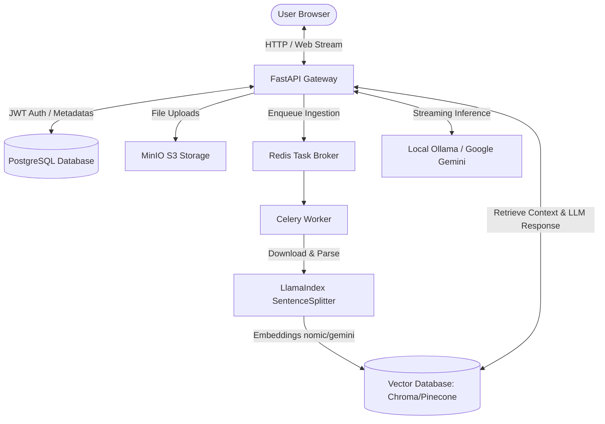

# Domain-Expert RAG Assistant (Enterprise Edition)

[](https://fastapi.tiangolo.com/)
[](https://nextjs.org/)
[](https://www.postgresql.org/)
[](https://redis.io/)
[](https://www.docker.com/)

A production-grade, multi-tenant Retrieval-Augmented Generation (RAG) system engineered for high-stakes domains (Finance, Legal, Medical). The system features an event-driven ingestion pipeline, semantic document parsing, hybrid retrieval, and secure tenant-isolated vector searching.

---

## 🏗️ Architecture & Data Flow



---

## 🚀 Key Features

*   **⚡ Decoupled Ingestion Pipeline**: Asynchronous PDF parsing, chunking, and indexing handled via **Celery & Redis** background workers. FastAPI remains non-blocking and fully responsive.
*   **🛡️ Secure Multi-Tenancy**: Data isolation at the vector database level. Embeddings are filtered by the authenticated user's `user_id` metadata before similarity calculation.
*   **🔍 High-Precision Parsing**: Semantic text parsing using LlamaIndex's `SentenceSplitter` (1024 token chunks, 256 token overlap) ensuring sentence integrity is maintained.
*   **🔗 Citation & Source Attributions**: Deduplicated citation metadata (filenames, page numbers) is injected into chat message responses in real-time.
*   **🌐 Flexible Dual-Mode Engine**: Run completely local for free development (Ollama + ChromaDB) or deploy to cloud-native services in production (Google Gemini + Pinecone Serverless).
*   **💾 Database-Agnostic Orm**: Uses standard SQLAlchemy `UUID` and `JSON` types enabling seamless SQLite support for local test suites while running PostgreSQL in production.

---

## 🛠️ Tech Stack

*   **Backend**: FastAPI, Python 3.12, SQLAlchemy 2.0, Alembic
*   **Frontend**: Next.js 14 (App Router), Tailwind CSS, Framer Motion, Zustand
*   **Task Management**: Celery, Redis
*   **Data Stores**: PostgreSQL (relational metadata), ChromaDB / Pinecone (vector index), MinIO (S3-compatible object storage)
*   **RAG Engine**: LlamaIndex, Ollama Embeddings, Google Gemini AI

---

## 📂 Project Directory Structure

```text
├── /backend
│   ├── /app
│   │   ├── /api            # Controllers, JWT middleware, versioned endpoints
│   │   ├── /core           # Configurations, Database engines, Security helpers
│   │   ├── /crud           # Repository layer abstracting database queries
│   │   ├── /models         # Relational database tables (User, Document, Chat, Message)
│   │   ├── /schemas        # Pydantic schemas for data serialization/validation
│   │   └── /services       # Business services (RAG, Storage, Ingestion)
│   ├── /worker             # Celery task definitions
│   ├── /tests              # Zero-dependency local SQLite test suite
│   ├── pyproject.toml      # Project configurations and dependencies
│   └── pytest.ini          # Pytest configurations
├── /frontend               # Next.js UI source code
└── /infrastructure         # Docker Compose configurations (Postgres, Redis, MinIO)
```

---

## 🚦 Getting Started

### 1. Prerequisites
Ensure you have the following installed:
*   Python 3.12+
*   Node.js 18+
*   Docker & Docker Compose

### 2. Environment Configuration
Copy the example environment file:
```bash
cp infrastructure/.env.example infrastructure/.env
```
Fill in your API credentials:
*   `SECRET_KEY`: Security JWT secret key.
*   `GEMINI_API_KEY`: API token from Google AI Studio.
*   `PINECONE_API_KEY`: Serverless Vector DB token.
*   `COHERE_API_KEY`: API token for Cohere reranking.

### 3. Launch Docker Infrastructure
```bash
cd infrastructure
docker-compose up -d
```
This launches:
*   **PostgreSQL** (port `5432`)
*   **Redis** (port `6379`)
*   **MinIO Console** (port `9001`, Storage port `9000`)

### 4. Setup Backend Service
```bash
cd ../backend
python -m venv .venv
source .venv/bin/activate  # On Windows: .venv\Scripts\activate

# Install dependencies and apply migrations
pip install -r requirements.txt
alembic upgrade head

# Run FastAPI Gateway
uvicorn app.main:app --reload --host 0.0.0.0 --port 8000
```

In a new terminal window, start the Celery background worker:
```bash
source .venv/bin/activate
celery -A worker.celery_app worker --loglevel=info
```

### 5. Setup Frontend
```bash
cd ../frontend
npm install
npm run dev
```
Open [http://localhost:3000](http://localhost:3000) to access the dashboard.

---

## 🧪 Running Tests

The test suite runs entirely local and doesn't require Docker or external services:
```bash
cd backend
source .venv/bin/activate
pytest -v
```

---

## 🔒 Security Best Practices
*   **JWT Bearer Tokens**: All chats, documents, and messaging endpoints require a valid JWT bearer token.
*   **Non-Blocking I/O**: High latency storage queries are offloaded to background threads using `asyncio.to_thread` to prevent thread pools blocking under load.
*   **Transactional Testing**: Unit tests run inside isolated database transactions which are rolled back after execution, leaving the local SQLite database clean.